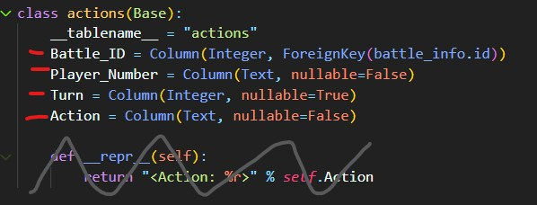
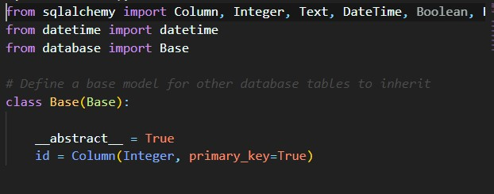

# Guide for Implementing the Battle Dispaly Page
## Packages to Learn:
1. Dash: https://dash.plotly.com
    * There are no examples of this in code currently
    * This will be the main part of the ask - creating a basic Dash display which I will provide an overview sketch of later in this documentation.
2. Pandas: https://pandas.pydata.org/docs/#
    * **Go To**: *frontend/battle_display.py* to see an example. Anything preprended with "pd" is a pandas function.
        * The above example has not yet been tested and may well break or not provide data as expected. If so:
            1. Try to workout the error - it is probably ~90% correct already so I think you'll be close
            2. Don't waste too much time trying to fix tho - if you have an error and it isn't obvious what to do after a few tries, please reach out :)
3. SQLAlchemy: https://docs.sqlalchemy.org/en/14/
    * **Go To:** *frontend/battle_display.py* yet again for an example. I used SQLAlchemy to create a "session" which I use to connect to the database. 
    * **For Example of Writing TO a database:** *battle_analyzer/pivots/Gather_Switch_Info.py*
        * Note: this won't be needed for the ask - I only put it in case you were interested in seeing one. 
4. Postgresql: https://www.postgresql.org/
    * You will need to download postgresql for your local computer for testing. Once  you get it, do the following to set it up:
        1. Try running "run.py" in the top level folder ("Poke_Tool")
        2. work through any errors that show up. I think there are a few things you typically have to do related to setting up "Path" environments. Look up a youtube video or stackoverflow to try to solve the issue
        3. Try repeat 1-2 until run.py succesfully completes. You should see a series of messages print about deleting database tables and re-establishing (I forget exact wording and message I wrote).
        4. If you get stuck - again - do not hesitate to reach out. I'm happy to work through any issues with you. I promise you - I broke this thing 1,000,000 times already. I won't judge ;). Heck, I still break it constantly. 

## Where is the Data?
1. The data will be in a database that the tool will setup on your local machine with run.py
2. Functionally, you will access it using SQLAlchemy to create a query that pandas will use to pull the data into a dataframe (often abbreviated "df"). 
    * Note: pandas is the bread and butter of python data analysis and will be VERY useful to you as a chemical engineer. Understanding how to interact with SQL databases will make you into a powerhouse. Almost every company utilizes SQL databases somewhere and the majority of chemical engineers are unable to do anything with this data unless given snapshots in Excel.
3. I have setup the basic data pull in frontend/battle_display.py. I have not yet tested it and I'm sure there will be a few errors, but it should be pretty close to what we want. 
4. To understand what data you have available, let us break down the "data model" I setup in battle_analyzer/Models.py. 
    1. Below is an example of one of the "models" that SQLAlchemy uses to setup the database.
        * 
            * We use classes in Python to define our tables in SQL through SQLAlchemy where the name of the class is the table name and it's "attributes" are the columns. If you are not yet super familiar with classes and the idea of an "object" in code I'd recommend this video: https://www.youtube.com/watch?v=JeznW_7DlB0
                * It is a bit long, but use the time stamps to jump past anything you may already know (not sure where you're coming from). I came from scratch and thus watched it all a few times lol!
            1. The Column is part of SQLAlchemy that tells the class "actions" how to setup the column. In the example of Battle_ID it will only accept Integers and it has a ForeignKey which refers to the class "battle_info", column "id" (represented as battle_info.id <-- how you access an attribute in a class))
                * Look up foreign keys in SQL if you are unfamiliar with the concept. They aren't too bad. 
            2. Ignore the def __repr__ part as it is not used nor is it overly important here or elsewhere in the tool. (basically if you tell the class to print itself it will return whatever is in __repr__) but I never ask it to do that - nor do I expect I ever will need to). 
            3. You'll notice class "actions" takes the parameter "Base". This is called inheritance. Basically, the class "actions" is a sub-class of "Base" which has its own set of attributes (in this case, only an auto-generated id. But if I ever wanted my other classes to all gain a new attribute I could add it once to Base instead of individually to all of them). 
        * Now let's take a look at Base quickly so that above makes more sense. I will pre-emptively apologize - Base will inherit Base... but it is a different Base which is a bit confusing
            * 
                1. As you can see, I import from "database" Base. If you go to database.py (in the top level folder : poke_tool/database.py) I created a "declarative base" using SQLAlchemy.
                    * Effectively, this tells SQLAlchemy whenever it is given an "instance" of, for example, an "actions" object (which is a sub-class of the Base class, which inherited this SQLAlchemy declarative base) that "hey, this thing can be mapped to a SQL table so I should treat it as such."

## What Data do I Need?
1. I've actually already taken the time to setup the class that will pull the data needed from the database in frontend/battle_display.py
    * Note: I have not tested it yet, and it may have a few bugs currently. It should give you a feel for the overall design, though. 
2. The goal is to create several displays for a given battle replay from pokemon showdown. The displays we care about are listed below:

### 1. Overall %HP Discrepancy Tracker
> In order to put all pokemon in a battle on an even playing field we track % HP instead of raw HP numbers since they vary (and also because in the latest gens the API doesn't tell us what the actual HP numbers are!). This display is meant to provide a way of gauging who had what kind of advantage on any given turn in a battle. The idea is to show, by turn, the %HP difference between player 1 and player 2. Please review the steps below to see the basic concept, as well as a few notes about how to handle some circumstances:
1. First, we will want to define what is a positive %HP and negative (as it can fluctuate between each throughout a battle). How do we determine which player to associate the positive of the y-axis to?
    * We will choose the player who ultimately won the battle. Any %HP gains for this player will be reported as positive and any losses will be reported as negative.
2. Upon turn 0, assume the %HP graph will start at parity, 0%. 
    * This is actually not always true, as sometimes people do not bring a "full team" to battle, and thus technically start with a disadvantage as far as this display is concerned. This is rare, and not good practice, though. Also, it's not very easy for us to determine with our current data so we will just say "don't do that" and make the assumption that both brought a full team and thus start at equal % hp. 
3. For each turn in the dataframe you get you will want to do the following calculation to determine if the %HP Disparity graph goes upwards (in the direction of the winner of the battle) or downwards (in the direction of the loser of the battle):
> turn_hp_disparity_change = (%HP healed_by_winner + %HP damage_dealt_by_winner) - (%HP healed_by_loser + %HP damage_dealt_by_loser)
>> In other words: the sum of (healing the winner got and damage the winner dealt) minus the sum of (healing the loser got and damage the loser dealt)
4. Run this calc on each turn, adding a new datapoint for each turn where it tracks the cumulative over time
> e.g. if on turn 1 the winner gained a 5% HP disparity and then did the same on turn 2, the graph, on turn 2, would show +10% HP rather than 5% again

### 2. Damage Dealt by Pokemon (Each Trainer left / right):
> This display will be a set of horizontal bar charts that represent, per player (thus creating 2 different charts, which I want to be organized by winner charts on the left and loser charts on the right), how much damage, in %HP, the distinct dmg_sources dealt in the battle. To determine the amount of damage dealt by each source you will do the following:
1. Player 1 Damage Dealt by Source:
    1. Filter the overall battle data for dmg_receiver startswith "p2" (thus identifying that the damage dealt was dealt to the opponent)
    2. Now sum up the damage_dealt for each unique source in dmg_source_name
2. Player 2 Damage Dealt by Source:
    1. Filter the overall battle data for dmg_receiver startswith "p1" (thus identifying that the damage dealt was dealt to the opponent)
    2. Now sum up the damage_dealt for each unique source in dmg_source_name

### 3. Damage Dealt by Type (Each Trainer left / right):
> This display will be a set of horizontal bar charts that represent, per player (thus creating 2 different charts, which I want to be organized by winner charts on the left and loser charts on the right), how much damage, in %HP, the different dmg_types were responsible for. To determine the amount of damage dealt by each dmg_type you will do the following:
1. Player 1 Damage Dealt by Type:
    1. Filter the overall battle data for dmg_receiver startswith "p2" (thus identifying that the damage dealt was dealt to the opponent)
    2. Now sum up the damage_dealt for each unique type in dmg_type
2. Player 2 Damage Dealt by Type:
     1. Filter the overall battle data for dmg_receiver startswith "p1" (thus identifying that the damage dealt was dealt to the opponent)
    2. Now sum up the damage_dealt for each unique type in dmg_type

### 4. Damage Received by Pokemon (Each Trainer left / right):
> This display will be a set of horizontal bar charts that represent the amount of damage each pokemon on a player's team received in the battle (and thus the sum of damage received should be equivalent to the sum of the damages dealt on the opponent's side of the page). 
1. Player 1 Damage Received by Pokemon (Each Trainer left / right):
    1. Filter the dmg_receiver with startswith "p1"
    2. Sum up the dmg_dealt for each unique pokemon in the filtered dmg_receiver list
2. Player 2 Damage Received by Pokemon (Each Trainer left / right):
    1. Filter the dmg_receiver with startswith "p2"
    2. Sum up the dmg_dealt for each unique pokemon in the filtered dmg_receiver list

### 5. Healing by Pokemon (Each Trainer left / right):
> This display will be a set of horizontal bar charts that represent the amount of healing each pokemon on a player's team received in the battle. 
1. Player 1 Healing by Pokemon:
    1. Filter the heal_receiver with startswith "p1"
    2. Sum up the healing for each unique pokemon in the filtered heal_receiver list
2. Player 2 Healing by Pokemon:
    1. Filter the heal_receiver with startswith "p2"
    2. Sum up the healing for each unique pokemon in the filtered heal_receiver list

### 6. Healing by Type (Each Trainer left / right):
1. Player 1 Healing by Type:
    1. Filter the heal_receiver with startswith "p1"
    2. Sum up the healing for each unique type in heal_type for the filtered list
2. Player 2 Healing by Type:
    1. Filter the heal_receiver with startswith "p2"
    2. Sum up the healing for each unique type in heal_type for the filtered list

### 7. Average Damage per "Entrance" (Each Trainer left / right):
> An "entrance" is defined as the sum of instances of a pokemon's name in the pivots table for a given battle_ID in the Pokemon_Enter column. I.e. you would query the pivots table for the battle name of a given pokemon (including the "p1" or "p2" prefix) where the Battle_ID = the battle_id of a particular battle. The number of entries in the pivots table = the number of entrances. 
1. Player 1 Average Damage per Entrance
    1. Filter the dmg_dealer for each pokemon that startswith "p1"
    2. Sum up the total dmg_dealt for each pokemon
    3. Divide by the number of instances that that pokemon showed up in the Pokemon_Enter column of the pivots table
1. Player 2 Average Damage per Entrance
    1. Filter the dmg_dealer for each pokemon that startswith "p2"
    2. Sum up the total dmg_dealt for each pokemon
    3. Divide by the number of instances that that pokemon showed up in the Pokemon_Enter column of the pivots table for this battle_id

### 8. Average Healing per "Entrance" (Each Trainer left / right):
1. Player 1 Average Healing per Entrance
    1. Filter the heal_receiver for each pokemon that startswith "p1"
    2. Sum up the total healing for each pokemon
    3. Divide by the number of instances that that pokemon showed up in the Pokemon_Enter column of the pivots table for this battle_id
1. Player 2 Average Healing per Entrance
    1. Filter the heal_receiver for each pokemon that startswith "p2"
    2. Sum up the total healing for each pokemon
    3. Divide by the number of instances that that pokemon showed up in the Pokemon_Enter column of the pivots table for this battle_id

### 9. Turn Player Choice Stats (Each Trainer left / right):
> This display will be a set of horizontal bar charts that represent the actions table information for each player. It will show how often a player chose an action, chose to "hard switch" (swap by turn action, not by move or item), or do nothing (which would indicate a number of scenarios not important for understanding how to build this graphic)
1. Player 1 Turn Choice Stats
    1. Filter the player actions for Player_Number 1
    2. Sum up the distinct strings in the Action column for a given battle_id
1. Player 2 Turn Choice Stats
    1. Filter the player actions for Player_Number 2
    2. Sum up the distinct strings in the Action column for a given battle_id

## Now the Final Part - Making it Dynamic
> Once the displays are working we want to make them dynamic (which is the key draw of dash plotly charts). I would like all of the data to be related, where possible for each graphic, by turn_number, pokemon (which will require checking the dmg_source_name and heal_source_name columns, depending on the chart being linked), dmg_type and heal_type. 
* Note: Not all filters will apply to all graphics. In fact, I'm not familiar enough with the plotly package yet to even know if all of that is possible
    * It is possible we'll need to make separate displays, which provide links to each other, that reflect different buckets of more closely related information, like:
        * Damage Display
        * Heal Display
* This will probably be the hardest part, especially since I am not able to rigorously define how I expect it to take place. See what you can figure out here and don't be afraid to reach out and let me know what limitations or problems you're encountering, as with the rest of this package!
* Also, do not feel bad if you decide you don't want to do this :) I will totally understand! 
* Best of luck and THANK YOU!!! It'll be cool working with you on this project! 
    * When we get the things working on our localhosts (i.e. our own machines) and are pleased with the displays I'll be figuring out how to host it and launch the official website! That will be pretty stinking cool to see, I think!